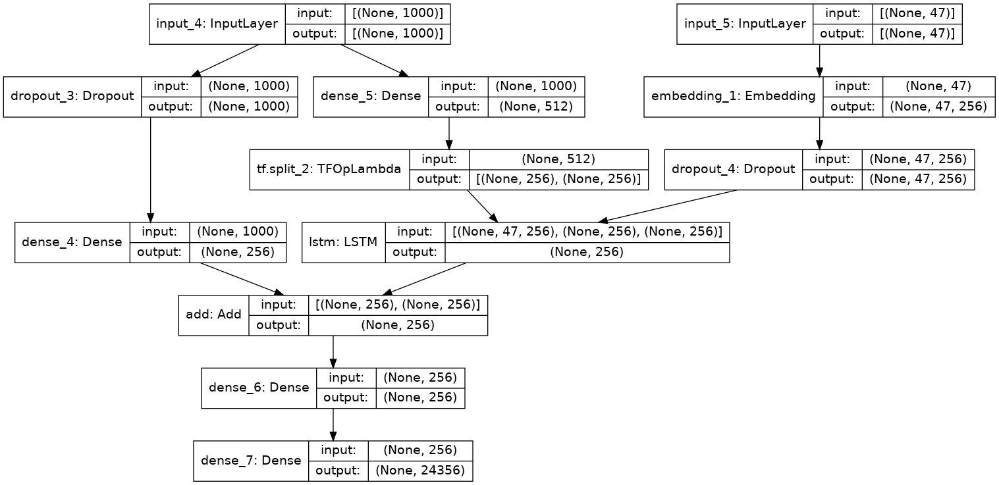
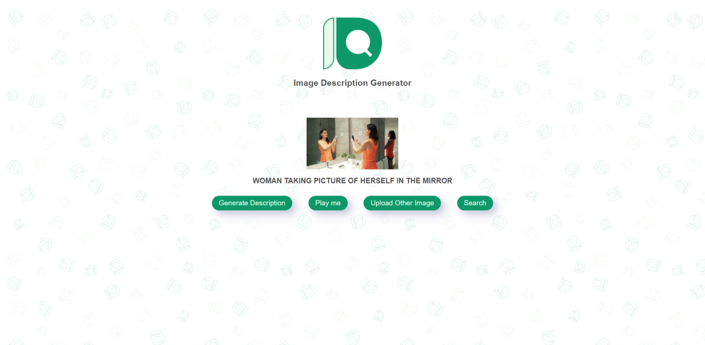
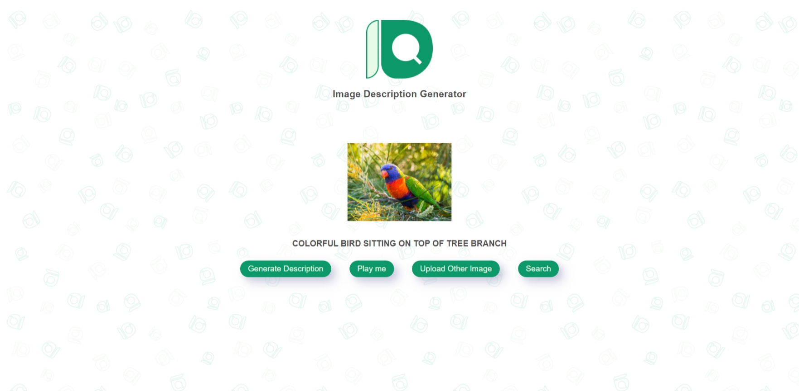

# Image Description

  
  

Image Description refers to the process of generating meaningful descriptions from images based on objects and activities detected in the images.

  

## Specifications

  

- Dataset : MS COCO 2014

  

- Dataset link : https://cocodataset.org/

  

- Image Datasize : 1,25,000

  

- Trainable Parameters : 13,855,013

  

- Layers : 12

  
 

### Model Architecture :

  

>  

  
 
  

## To run this project on local machine

  

  

- Install virtualenv by:

  

>  `pip install virtualenv`

  

- Create virtual environment :

  

>  `virtualenv my_env`

  

- Activate virtual env :

  

>  `my_env\Scripts\activate`

  

- Install requirements for project :

  

>  `pip install -r requirements.txt`

  

- Run this project :

  

>  `python app.py`

- Test the project :

> Go to localhost:9999 in your browser.

 

## Live Version

> You can see it on *https://img-descriptor.herokuapp.com/*

 

## Output

 

## Creators

 - Dhaval Jotaneeya : [@Dhaval-Jotaneeya](https://github.com/Dhaval-Jotaneeya)
 - Harsh Patel : [@limbaniharsh](https://github.com/limbaniharsh)
 - Dhruvik Patel : [@dhruvik-patel](https://github.com/dhruvik-patel)
 - Hardik Gohil : [@hardikgohil73253](https://github.com/hardikgohil73253)
